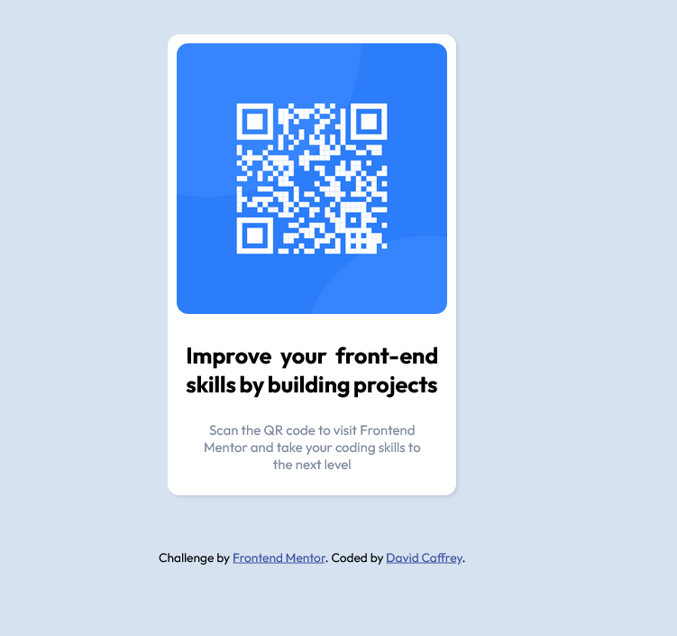

# Frontend Mentor - QR code component solution

This is a solution to the [QR code component challenge on Frontend Mentor](https://www.frontendmentor.io/challenges/qr-code-component-iux_sIO_H). Frontend Mentor challenges help you improve your coding skills by building realistic projects. 

## Table of contents

- [Overview](#overview)
  - [Screenshot](#screenshot)
  - [Links](#links)
- [My process](#my-process)
  - [Built with](#built-with)
  - [What I learned](#what-i-learned)
  - [Continued development](#continued-development)
  - [Useful resources](#useful-resources)
- [Author](#author)
- [Acknowledgments](#acknowledgments)

## Overview
To recreate the QR code from the design resources provided by frontendmentor.io. Given three png images and a design spec/doc the design was completed using HTML and CSS.

### Screenshot

### Links

- Solution URL: [Add solution URL here](https://github.com/DavidCaffrey/QR-Code-Component)
- Live Site URL: [Add live site URL here](https://davidcaffrey.github.io/QR-Code-Component/)

## My process
Working from the images and design spec/doc.

### Built with

- Semantic HTML5 markup
- CSS custom properties
- Flexbox
- CSS Grid

### What I learned
I approached this project from a desktop first approach and this was a mistake that I will not commit again as I felt it made the task more difficult.Also given that this was a 
simple card Element a mobile first is the best approach.

### Continued development
As this was my first coding challenge from frontendmentor, I have not submitted it to them. For future challenges I intend to use their pro fitures in order to avail of more detailed 
design info and to also submit the challenges.

### Useful resources

## Author
As I currently do not have a personal portfolio site I am temporaliy using my Git hub account.

- Website - [Add your name here](https://github.com/DavidCaffrey)
- Frontend Mentor - [@yourusername](https://www.frontendmentor.io/profile/DavidCaffrey)
- Twitter - [@yourusername](https://www.twitter.com/yourusername)

## Acknowledgments

I would like to acknowledge frontendmentor for providing this challenge as I think it is a great tool for practicing and showcasing my skills.
